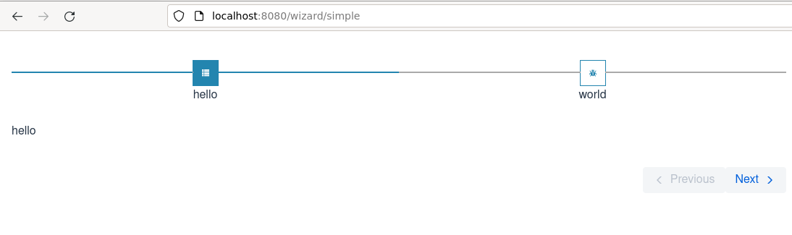

# aire-wizard

Aire-wizard is a full-featured wizard component for Vaadin flow

## Contributing

1. Clone the repo: `git clone git@github.com:aire-ux/aire-wizard`
1. Prepare package for development: `gradle prepareDevelop`. This runs:
    - npm link (links the local package to `@aire-ux/aire-wizard`)
    - npm link `@aire-ux/aire-wizard@<version>` where version is specified in package.json

## Features
The Aire Wizard supports:
1. Arbitrarily-complex wizard topologies
2. Auto-generation of controls
3. Horizontal and vertical step layout
4. Localization
5. Browser history integration
6. validation
7. model-passing
8. steps-per-icon

### Simple Usage

```java

@Route("simple/wizard")
public class SimpleWizard extends VerticalLayout {

  public SimpleWizard() {
    wizard = new Wizard<>();
    wizard.addSteps(Page1.class, Page2.class);
    wizard.addTransition(Page1.class, Page2.class);
    wizard.setInitialStep(Page1.class);
    add(wizard);
  }
}

@WizardPage(key = "page-1", title = "hello")
public class Page1 extends AbstractWizardPage<String, Object> {


}
@WizardPage(key = "page-2", title="hello")
public class Page2 extends AbstractWizardPage<String, Object> {


}

```
Result:




